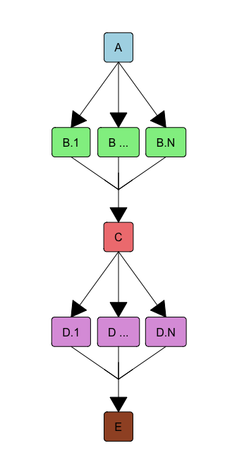

Building a living tree of refseq equivalogs
================
Nicholas Cooley
2025-05-27

- [What is this?](#what-is-this)
  - [Ok, so specifically?](#ok-so-specifically)
  - [Planning](#planning)
  - [Collection](#collection)
  - [Planning (again)](#planning-again)
  - [Comparison](#comparison)
  - [Planning (again, probably)](#planning-again-probably)
  - [Community detection](#community-detection)
  - [Planning (again, probably)](#planning-again-probably-1)
  - [Functional association](#functional-association)
  - [DAG end and future steps](#dag-end-and-future-steps)
- [Why HTCondor and the Open Science
  Grid?](#why-htcondor-and-the-open-science-grid)
- [Why R?](#why-r)
- [Is this finished?](#is-this-finished)
- [An extremely minimal code example of what’s going
  on](#an-extremely-minimal-code-example-of-whats-going-on)
- [What is left to do here?](#what-is-left-to-do-here)

# What is this?

This repo contains the infrastructure for a project that has been
brewing for a long time, and been deployed in static states a few times
over the years. The **Li**ving **T**ree of **R**efseq **E**quivalogs was
envisioned as a set of high quality orthology inferences made from
genomic features annotated in RefSeq bacterial *reference* (though this
was previously the
[representative](https://ncbiinsights.ncbi.nlm.nih.gov/tag/representative-genome/)
tag) assemblies.

The interchanging of equivalog and ortholog is a bit of of a confusing
muddle, though it comes from the separation of *shared function* from
the classic *orthology conjecture*. This separation is to some extent
necessary because shared function doesn’t necessarily have to only be
associated with descent through speciation alone. Though historical
methods of functional inference have leveraged the overlap of those two
concepts, the current deluge of genomic data particularly in bacteria
require a paradigm shift in how homology can be leveraged to identify
shared function without relying on implied evolutionary history. This
term hasn’t come out of thin air, and appears in [PGAP
documentation](https://www.ncbi.nlm.nih.gov/genome/annotation_prok/evidence/)
at least a few times.

The *living* aspect of this project is relatively simple in that it is
designed to re-run on top of its own previous results as new assemblies
are added to RefSeq. This includes the ability to either trigger the job
manually, or through a system scheduling tool like
[cron](https://en.wikipedia.org/wiki/Cron). So as refseq expands, so
does this project.

## Ok, so specifically?

This project currently consists of a 4 node DAG represented in the
`Manager.dag` file in the `DAG` folder. Folks at the OSG have
colloquially referred to the general structure of this DAG as a shish
kebab, so we’ll stick with that. Basically the general parent child
relationships between nodes are linear and uncomplicated. This lack of
complication dissipates in some sense on the interior of a few nodes,
but that’s the nature of doing large complex analyses.

<div class="figure" style="text-align: center">


<p class="caption">
DAG structure; A) initial planning, B) data collection, C) comparison
planning, D) comparison collection, E) future nodes…
</p>

</div>

## Planning

The simplest step in the project (kind of). Use the NCBI
[edirect](https://www.ncbi.nlm.nih.gov/books/NBK179288/) tools to go out
and ask for (in this case) all of the complete refseq reference genomes.
Edirect is *really* powerful, though not always [easy to
leverage](https://ncbi-hackathons.github.io/EDirectCookbook/). The meat
of this is the programmatic construction of our edirect query, the
execution of that query, and the reconciliation of those returned
results with any pre-existing query results from previous iterations of
the DAG.

``` r
# our current query

Target <- "Prokaryotes"
EntrezQuery <- paste0("esearch -db assembly ",
                     "-query '",
                     Target,
                     "[organism] ", # target organism can be changed here
                     'AND "complete genome"[filter] ', # only complete genomes
                     'AND "refseq has annotation"[properties] ', # only genomes with annotations
                     'AND "latest refseq"[filter] ', # only latest
                     'AND "taxonomy check ok"[filter] ',
                     'AND "reference genome"[filter] ',
                     "NOT anomalous[filter]' ",
                     '| ',
                     'esummary ',
                     '| ',
                     'xtract -pattern DocumentSummary -element FtpPath_RefSeq')

FTPs <- system(command = EntrezQuery,
               intern = TRUE,
               timeout = 1000L)
```

## Collection

Ask a bunch of nodes to go out and grab a whole bunch of data. We are
essentially creating static representations of some NCBI data that we
can manage ourselves. Although it isn’t the most likely thing to have
happen refseq reannotations with PGAP are performed on a rolling basis,
meaning if we solely pull directly from the NCBI in our future steps, we
risk the chance of an annotation version changing halfway through an
analysis silently, which would a difficult problem to overcome.
Additionally, the OSG’s caching system and the
[OSDF](https://osg-htc.org/services/osdf) are more appropriate tools for
passing this data around than just repeatedly annoying NCBI servers.

## Planning (again)

Setting up an all-vs-all comparison step is conceptually simple (it’s
just the upper triangle!), but functionally complicated, particularly on
free and shared compute resources. Thankfully Condor shines at this type
of task, and at the end of the day a pseudo-cyclic DAG structure
repeatedly releases flights of comparisons in a manner loosely optimized
for throughput against the constraints of available and requested
compute resources.

## Comparison

All that work to get to here. Equivalog inference is performed in a
massively parallel manner with relatively simple code, and the results
are packaged away for intermediate storage.

``` r
###### -- example code here ---------------------------------------------------
# look into the sub folders, package help files, and later example for the real stuff ...

# create a synteny map
Syn <- FindSynteny(dbFile = DBPATH,
                   verbose = TRUE)

# identify where features are connected by syntenic hits
L01 <- NucleotideOverlap(SyntenyObject = Syn,
                         GeneCalls = GCList,
                         Verbose = TRUE)

# some overhead work
PrepareSeqs(SynExtendObject = L01,
            DataBase01 = DBPATH)

# summarize connected features, do some other things
P01 <- SummarizePairs(SynExtendObject = L01,
                      DataBase01 = Conn01,
                      RejectBy = "direct",
                      Verbose = TRUE)

# compete connected features to generate a candidate set of 1-1 equivalogs
P02 <- WithinSetCompetition(SynExtendObject = P01,
                            AllowCrossContigConflicts = FALSE,
                            CompeteBy = "Delta_Background",
                            PollContext = FALSE,
                            Verbose = TRUE)
```

## Planning (again, probably)

Yet to be actualized, but following the collection of our candidate
pairs, we’ll likely need some sort of planning step to preceede
community detection.

## Community detection

The fantastic [Aidan Lakshman](https://github.com/ahl27) constructed
[Exolabel](https://www.ahl27.com/posts/2025/04/exolabel-full/) to
perform this step, and eventually it will be deployed here to collect
our equivalent to what folks commonly call
[COGs](https://www.ncbi.nlm.nih.gov/research/cog-project/).

## Planning (again, probably)

Yet to be actualized, but following equivalog group construction, these
groups can be subject to an all-vs-all comparison step (once again!) to
identify where groups are functionally co-evolving.

## Functional association

Another [Aidan Lakshman](https://github.com/ahl27) product,
[Evoweaver](https://www.nature.com/articles/s41467-025-59175-6) will be
deployed here to identify functional relationships between equivalog
groups.

## DAG end and future steps

This is where the real fun will begin…

Our group has our own hopes to use these functional associations to do
things like annotation through association in places where there are
connections between functionally described and functionally undescribed
equivalog groups, but we also have the overarching goal of ensuring that
the data products produced in this main pipeline will be available for
use by others, and can serve as hypothesis generation tools for folks
with varieties of interests.

# Why HTCondor and the Open Science Grid?

The LiTRE as it is currently envisioned is easy parallelizable and
requires a modest amount of compute time. Only one current step requires
a single compute node even modestly resembling an HPC system, and that
in and of itself is relatively manageable. However, even a modest amount
of cloud compute on simple resources isn’t necessarily an easy line-item
to justify in an academic budget, so deploying this project on the [Open
Science Grid](https://osg-htc.org/) is functionally a no-brainer as it
eliminates compute cost entirely. Additionally, the folks who support
the [Open Science Pool](https://osg-htc.org/services/ospool/) are a
fantastic resource themselves.

The OSPool is accessed through [HTCondor](https://htcondor.org/), which
is a scheduler designed to work with highly distributed resources.
Though my experience with other schedulers is relatively limited, Condor
can thematically be viewed like a more traditional scheduler with the
additional capability of managing resources across multiple sites,
institutions, countries, and continents.

# Why R?

The business end of this project is largely performed in
[R](https://www.r-project.org/), because that is what this author uses.
This section is not meant to be another salvo in the programming
language wars, but R does have a few advantages;

- Scheduled biannual updates
- Strong support from a core team of dedicated statisticians,
  mathematicians, and computer scientists
- Strong support for genomics and bioinformatics through the
  [Bioconductor project](https://www.bioconductor.org/)
- Easy containerization of specific tasks or generalized environments
  through the [Rocker project](https://rocker-project.org/)

Additionally, the central equivalog inference tools being deployed in
this project are present in the R package
[SynExtend](https://bioconductor.org/packages/release/bioc/html/SynExtend.html),
many of the additional general tools that are leveraged are present in
the R package
[DECIPHER](https://bioconductor.org/packages/release/bioc/html/DECIPHER.html),
and the toolsets for performing [community
detection](https://www.ahl27.com/posts/2025/04/exolabel-full/) and
[functional
association](https://github.com/WrightLabScience/EvoWeaver-ExampleCode)
constructed by the fantastic [Aidan Lakshman](https://github.com/ahl27)
are also present in SynExtend.

It is entirely likely that as this project evolves, different steps will
be implemented in different environments or languages, but for now
everything present in this repo is either Condor specific language, R,
or [bash](https://www.gnu.org/software/bash/) – the shell in use on the
OSG login nodes.

# Is this finished?

No.

# An extremely minimal code example of what’s going on

This code mirrors some of our internal tests, and gives a fairly good
representation of both how the code works, and one of the areas where
this task is difficult. Two relatively distantly related assemblies from
within the same genus can be compared for candidate equivalog pairs,
though much further beyond that gets out of the scope of a readme
document. Their relative divergence can be visualized both in the
synteny map, and the histogram of candidate pairs.

``` r
suppressMessages(library(SynExtend))
suppressMessages(library(RSQLite))

# build a test set from a single edirect query
target <- "Kiritimatiellota"
dbpath <- tempfile()


# construct our edirect query
edirect_query <- paste0("esearch -db assembly ",
                        "-query '",
                        target,
                        "[organism] ", # target organism can be changed here
                        'AND "complete genome"[filter] ', # only complete genomes
                        'AND "refseq has annotation"[properties] ', # only genomes with annotations
                        'AND "latest refseq"[filter] ', # only latest
                        'AND "taxonomy check ok"[filter] ', # passes tax check
                        'AND "reference genome"[filter] ',
                        "NOT anomalous[filter]' ",
                        '| ',
                        'esummary ',
                        '| ',
                        'xtract -pattern DocumentSummary -element FtpPath_RefSeq')

# run the query
edirect_result <- system(command = edirect_query,
                         intern = TRUE,
                         timeout = 600)

print(edirect_result)
```

    ## [1] "ftp://ftp.ncbi.nlm.nih.gov/genomes/all/GCF/009/905/215/GCF_009905215.1_ASM990521v1"
    ## [2] "ftp://ftp.ncbi.nlm.nih.gov/genomes/all/GCF/001/017/655/GCF_001017655.1_ASM101765v1"

``` r
conn01 <- dbConnect(SQLite(), dbpath)
pBar <- txtProgressBar(style = 1)
PBAR <- length(edirect_result)
genecalls <- vector(mode = "list",
                    length = PBAR)

adds <- mapply(SIMPLIFY = TRUE,
               USE.NAMES = FALSE,
               FUN = function(x, y) {
                 paste0(x,
                        "/",
                        y[10],
                        c("_genomic.fna.gz",
                          "_genomic.gff.gz",
                          "_protein.faa.gz"))
               },
               x = edirect_result,
               y = strsplit(x = edirect_result,
                            split = "/",
                            fixed = TRUE))
fnas <- adds[1, ]
gffs <- adds[2, ]

for (m1 in seq_along(edirect_result)) {
  Seqs2DB(seqs = fnas[m1],
          identifier = as.character(m1),
          type = "FASTA",
          dbFile = conn01,
          verbose = FALSE)
  genecalls[[m1]] <- gffToDataFrame(GFF = gffs[m1])
  
  setTxtProgressBar(pb = pBar,
                    value = m1 / PBAR)
}
```

    ## ================================================================================

``` r
names(genecalls) <- seq(length(genecalls))

syn <- FindSynteny(dbFile = conn01,
                   verbose = TRUE)
```

    ## ================================================================================
    ## 
    ## Time difference of 16.63 secs

``` r
print(syn)
```

    ##            1        2
    ## 1      1 seq 20% hits
    ## 2 608 blocks    1 seq

``` r
pairs(syn)
```

<!-- -->

``` r
l01 <- NucleotideOverlap(SyntenyObject = syn,
                         GeneCalls = genecalls,
                         Verbose = TRUE)
```

    ## 
    ## Reconciling genecalls.
    ## ================================================================================
    ## Finding connected features.
    ## ================================================================================
    ## Time difference of 0.1816089 secs

``` r
PrepareSeqs(SynExtendObject = l01,
            DataBase01 = conn01,
            Verbose = TRUE)
```

    ## Preparing overhead data.
    ## ================================================================================
    ## Complete!
    ## Time difference of 1.043867 secs

``` r
p01 <- SummarizePairs(SynExtendObject = l01,
                      DataBase01 = conn01,
                      Verbose = TRUE,
                      SearchScheme = "standard",
                      RejectBy = "kmeans")
```

    ## Collecting pairs.
    ## ================================================================================
    ## Time difference of 1.120618 mins

``` r
p02 <- WithinSetCompetition(SynExtendObject = p01,
                            AllowCrossContigConflicts = TRUE,
                            Verbose = TRUE)
```

    ## ================================================================================
    ## initial pass complete!
    ## ================================================================================
    ## final pass completed!
    ## Time difference of 0.3792439 secs

``` r
par(mar = c(3, 3, 3, 1),
    mgp = c(2, 0.75, 0))
hist(p02$Approx_Global_PID,
     breaks = seq(from = 0,
                  to = 1,
                  by = 0.01),
     xaxs = "i",
     yaxs = "i",
     main = "Global",
     xlab = "PID")
```

<!-- -->

# What is left to do here?

This project isn’t necessarily in its infancy, but it is far from
completion. Of six thematic steps initially envisioned only 4 are
present. The current pipeline as it exists ends after equivalog
inference, and all of our lab’s internal work that occurs after that is
being performed either locally, or in ad hoc DAGs on the open science
grid. So there’s a lot left to do, particularly in the vein of packaging
data and code products from this project for use outside of our lab and
for research goals or interests that we ourselves haven’t envisioned.

Some structural additions are also eventually planned, like expansion of
the initial data collection to include more than just complete
assemblies, and more than just prokaryotic assemblies, though those
tasks seem to continually get shuffled to the bottom of the stack.
